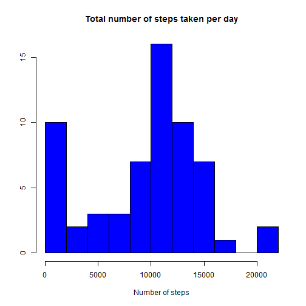
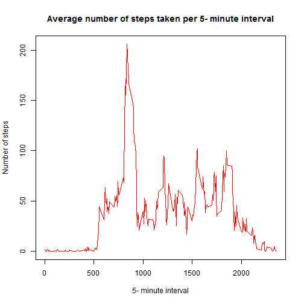

# Reproducible Research: Peer Assessment 1


## Loading and preprocessing the data


```r
dt<-read.csv(unz('activity.zip','activity.csv'))
```
Add a new variable in the dataset: 
* newID: an identifier for the 5-minute interval within the day (a progressive integer  from 1 to 288).


```r
newID<-vector(mode="numeric",length=dim(dt)[1])

for(i in 1:dim(dt)[1]){
	newID[i]=ifelse(i%%288==0, 288, i%%288);
}
dt$newID<-newID
```

## What is mean total number of steps taken per day?

```r
TotSteps<-tapply(dt$steps,as.factor(dt$date),sum,na.rm=TRUE)
hist(as.vector(TotSteps),breaks=10,main='Total number of steps taken per day',xlab='Number of steps',ylab='',col='blue')
```

 

* Mean and Median of total number of steps taken per day

```r
s<-summary(TotSteps)
print(paste("Median =",s["Median"]))
```

```
## [1] "Median = 10400"
```

```r
print(paste("Mean =",s["Mean"]))
```

```
## [1] "Mean = 9350"
```


## What is the average daily activity pattern?

```r
IntvAvg<-tapply(dt$steps,as.factor(dt$interval),mean,na.rm=TRUE)
```

* Time series plot of the 5-minute interval and the average number of steps taken, averaged across all days


```r
plot(as.numeric(unique(dt$interval)),IntvAvg,type='l',main='Average number of steps taken per 5- minute interval',xlab='5- minute interval',ylab='Number of steps',col='red')
```

 

* 5- minute interval with the maximum number of  steps on average

```r
print(paste("5-minute interval id: ",names(which.max(IntvAvg))));
```

```
## [1] "5-minute interval id:  835"
```


```r
print(paste("maximum number of  steps on average: ",IntvAvg[which.max(IntvAvg)]))
```

```
## [1] "maximum number of  steps on average:  206.169811320755"
```

## Imputing missing values

* Total number of missing values in the dataset


```r
print(paste("Number of missing value: ",nrow(dt[is.na(dt$steps)==T | is.na(dt$date)==T | is.na(dt$interval),])))
```

```
## [1] "Number of missing value:  2304"
```

dt2 is a new dataset equal to the original dataset but with the missing data replaced with the mean for that 5-minute interval

```r
dt2<-dt;

newsteps<-vector(nrow(dt),mode="numeric")
for(i in 1:nrow(dt)){
	newsteps[i]=ifelse(is.na(dt$steps[i])==T,IntvAvg[as.character(dt$interval[i])],dt$steps[i]);
}

dt2$steps<-newsteps;
```


## Are there differences in activity patterns between weekdays and weekends?
